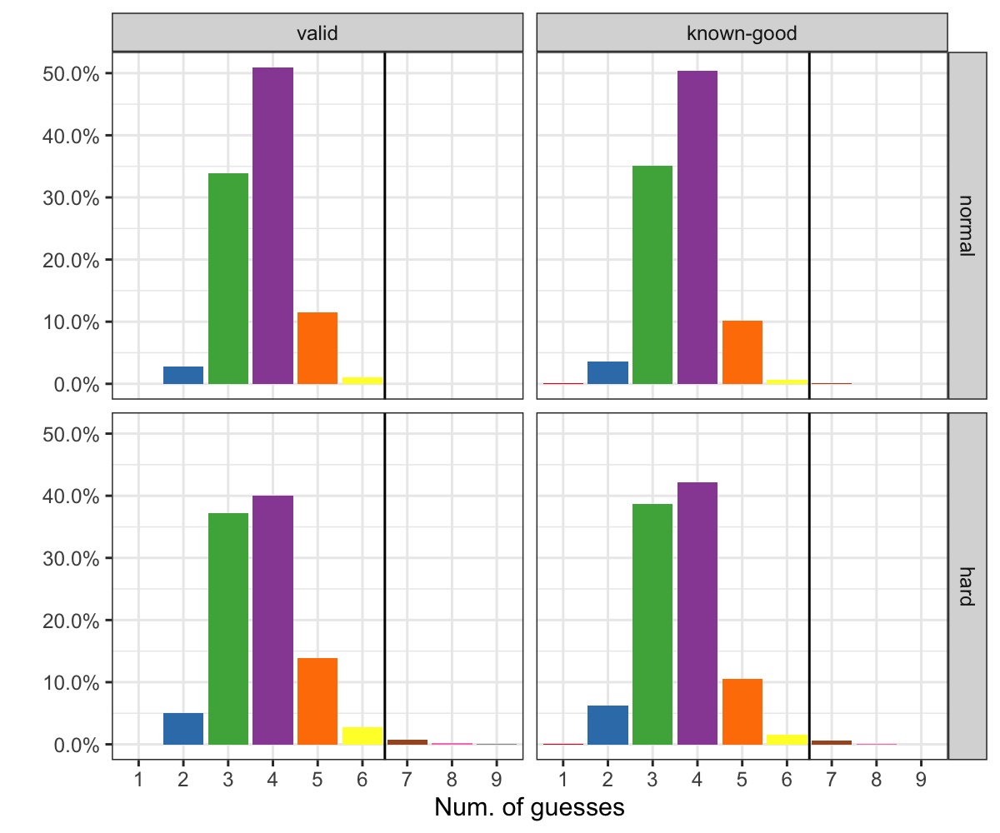

# Wordle Solver

The main idea for this solver is to find the guesses that will be the most informative. This is based on frequency analysis and the composition of known word lists.

The main concept is to find letters that best split the possible word lists best. To do this, we look at the frequency that each letter occurs in all of the possible words. The list of possible words is based on a known word list and is pruned to keep only words that are possible (with the known good/green letters and known included/yellow letters). The overall frequency of each letter in all words is calculated. The overall frequency for each letter at each position in the words is also calculated -- this is the primary data that we'll use.

Once the frequencies are calculated, each word in a list of possible words is scored. The word with the best score should be the next guess. These two word lists aren't necessarily the same (valid answers, valid guesses).

Scoring is done as follows:

* For each position in the board, 
  * if we **don't** already know the letter at this position, then the score is the frequency score for that letter at that position. The idea here is to get the most information about this specific position.
  * if we **do** know the letter at this position, then we can skip it and use the global frequency score for the letter. For example, if we know a position is a "T", then we would want to guess anything but a "T" here. But, we don't want to use the frequency scores at this position, because we already know this specific position. In this case, we would want to use the global frequency scores.
    * additionally, if we know the letter at a given position, then any guess with this letter at the position is uninformative, so we try to find a word that has any other letter at this position. In this case, this letter's score at this position is set to zero.
    * Note: while we may know a letter at a specific position, that doesn't mean that letter can't be some other place in the word. So, we will still allow for that letter to be at a different position. Also, if a letter is included in a guess multiple times, only the highest score will be used. (So in the word ALLEY, "L" is only scored once.

Because we are looking to find the letters that best split the remaining pool of words, we don't want to use the raw frequency as the score. Instead we will transform it to be:

* If freq < 0.5:
    * score = freq / 1-freq
* otherwise
    * score = 1-freq / freq

This has the effect of amplifying the score for frequencies close to 0.5 and reducing the scores for frequencies that are near 0.0 or 1.0. (The best scores is freq = 0.5 => 0.5/0.5 => 1). This doesn't really come into play until guesses 2 or 3, as the letter frequencies are all below 0.5 before the first guess.

## Word lists

Some valid word lists can be retrieved from here:

    https://github.com/powerlanguage/word-lists

Or the actual word lists used in Wordle itself can be found in the `data/` directory. These lists have been sorted alphabetically, so you can't use these to cheat! :) There are two lists: the list of good solutions ([data/good.txt](), 2314), and the list of valid words ([data/valid.txt](), 10657+2314 = 12971). Because Wordle itself allows you to enter words that aren't necessarily valid solutions, we can use those to our advantage (see below).

## Hard mode

In "hard" mode (Wordle setting), any information you get from a guess must be used in the next steps. So, for example, if you find our the first letter is an "L" (green), and the word contains an "E", then all subsequent guesses must start with an "L" and contain an "E". In the solver, this is handled by also pruning the "valid" guess list to only contain words that match the known information. Otherwise, any word in the valid guess list can be used.

# Usage

To use the solver, you can run it from the command-line. The board is represented as a five character list. Unknown letters should be a period (.), but if you know the letter (a green letter), then enter that. For example, if the word is "CIGAR" and you guessed "CAGES", the board for the next round would be: 'C.G..'.

## Interactive mode

Here is an example usage. Again, the target word is "CIGAR".

    $ ./solver.py --help
    Usage: solver.py board good_letters guess1 {guess2...}

    $ ./solver.py
    Guess: SAINE
    $ ./solver.py ..... AI SAINE
    Guess: TRAIL
    $ ./solver.py ..... AIR SAINE TRAIL
    Guess: CIGAR

In this mode, you can also have the solver give you a number of possible guesses with the `--guesses N` option. Potential guesses will be sorted by score and then alphabetically. For example: 

    $ ./solver.py --guesses 10
    Guess: SAINE 0.778
           SOARE 0.772
           SAICE 0.763
           SLANE 0.745
           SLATE 0.724
           SOAVE 0.722
           SOILY 0.716
           SAMEY 0.712
           SAUCE 0.710
           SLICE 0.707

## Auto mode

You can also see the guesses the solver would have suggested for a given word. For example:

    $ ./solver.py auto CIGAR
    CIGAR => SAINE,TRAIL,CIGAR

## Benchmark mode

Finally, you can also calculate benchmarks for how well the solver does on every word in the "good" list:

You can also see the guesses the solver would have suggested for a given word. See the results for more usage information.

## Options

For all modes, you can set three options:

1. the "good" solution word list (--good)
2. the "valid" guess list (--valid)
3. you can also set the solver for "hard" mode (--hard).
   In hard mode, any hints must be used (green letters in the right place, yellow letters included)

## Requirements

The only requirement for the solver is that Python 3 is installed.

# Solver results

The solver was benchmarked across all of the known solutions. The solver was benchmarked using only the words which are solutions (known-good) and using all of the possible words (valid). The solver was also benchmarked using normal or hard difficulty levels.

<figcaption align = "center"><b>Figure 1</b> Histograms of the number of guesses required for each word in the Wordle known answer list for each strategy combination. The strategies used were using the expanded valid word list for guesses (valid) or using only the known answer list (known-good). The other option was to restrict answers to "hard" mode or "normal" mode.</figcaption>

Using the expanded "valid" guesses list (default, success rate: 100%):

    $ ./solver.py benchmark --valid data/valid.txt --good data/good.txt
    Min: 2
    Max: 6
    Ave: 3.7408207343412525
    2 guess: 64
    3 guess: 784
    4 guess: 1178
    5 guess: 266
    6 guess: 23

    Best starting word: SAINE

Using only the "known-good" answers word list (success rate: 99.96%):

    $ ./solver.py benchmark --valid data/good.txt --good data/good.txt
    Min: 1
    Max: 7
    Ave: 3.6907127429805615
    1 guess: 1
    2 guess: 84
    3 guess: 812
    4 guess: 1167
    5 guess: 236
    6 guess: 14
    7 guess: 1

    Best starting word: SLATE

Using the expanded "valid" guesses list (--hard mode, success rate: 98.96%):

    $ ./solver.py benchmark --hard --valid data/valid.txt --good data/good.txt
    Min: 2
    Max: 9
    Ave: 3.755075593952484
    2 guess: 117
    3 guess: 862
    4 guess: 927
    5 guess: 320
    6 guess: 65
    7 guess: 18
    8 guess: 5
    9 guess: 1

Using only the "known-good" answers word list (--hard mode, success rate: 99.31%):

    $ ./solver.py benchmark --hard --valid data/good.txt --good data/good.txt
    Min: 1
    Max: 8
    Ave: 3.6444924406047514
    1 guess: 1
    2 guess: 146
    3 guess: 895
    4 guess: 977
    5 guess: 244
    6 guess: 36
    7 guess: 13
    8 guess: 3

So, using the "valid" list for guesses makes things marginally worse in the average case, but makes all of the words guessable in 6 turns. Interestingly, the best first guess for the valid list is not a valid solution, so you will never get a 1-turn guess. But, you also never have a puzzle that you can't solve in 6 guesses.

From these results, you can see that when you restrict the possible guesses (hard mode), then the average scores aren't affected. However, there is a difference in the worst-case scenarios. In each case, when more restrictions were added (either by using a smaller valid guess list or hard mode), the worst-case scenario number of guesses was always higher.